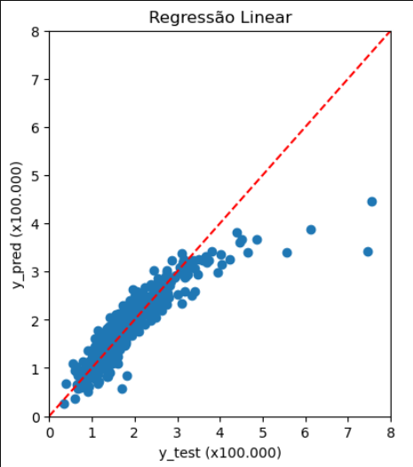
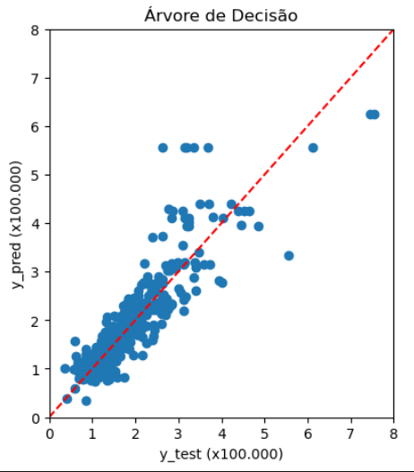
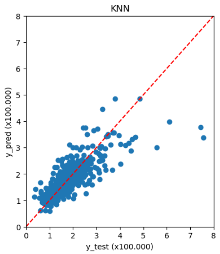
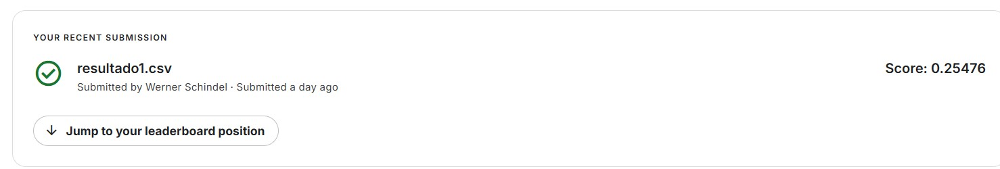

# Projeto: House Prices - Advanced Regression Techniques

Este projeto faz parte da competição do Kaggle [House Prices - Advanced Regression Techniques](https://www.kaggle.com/competitions/house-prices-advanced-regression-techniques).  
O objetivo é prever o preço de venda de casas com base em diversas variáveis.

---

## 📊 Análise Exploratória
A análise exploratória inicial concentrou-se em:
- Identificação de **features numéricas** e exclusão de variáveis categóricas nesta primeira modelagem.
- Remoção de features com **mais de 10% de dados ausentes**.
- Preenchimento dos valores nulos restantes com **-1** para manter a consistência dos dados.
- Geração de estatísticas descritivas e gráficos para identificar relações entre as variáveis.

---

## 🤖 Modelagem Inicial
Foram testados três algoritmos clássicos de regressão apenas com features numéricas:
1. **Regressão Linear**
2. **Árvore de Decisão**
3. **KNN (K-Nearest Neighbors)**

Os modelos foram comparados com base no erro de previsão e visualização gráfica.

---

## 📈 Scatter Plots dos Modelos

### Regressão Linear

### Árvore de Decisão

### KNN

---

## 🏆 Submissão no Kaggle

Primeiro resultado submetido:  
Arquivo: **resultado1.csv**  
Score obtido: **0.25476**

---

## 📌 Conclusões
- A regressão linear apresentou o comportamento mais estável, porém com erro considerável.  
- Árvores de decisão e KNN trouxeram resultados menos consistentes, mostrando a necessidade de **tratamento de variáveis categóricas** e **engenharia de features**.  
- Próximos passos incluem: encoding de variáveis categóricas, normalização de dados e teste de modelos mais robustos como **Random Forest** e **XGBoost**.
